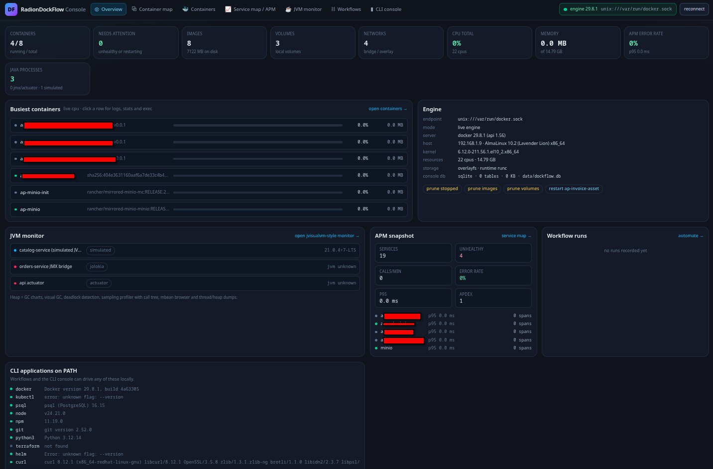
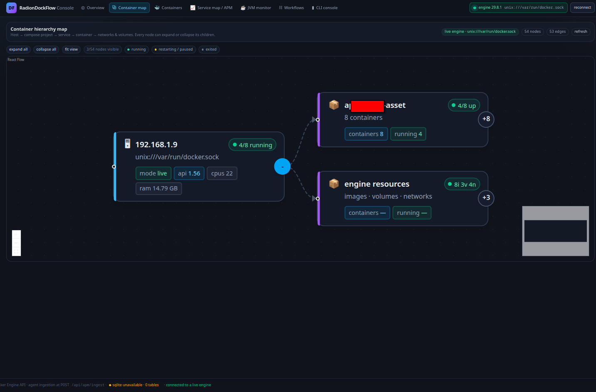
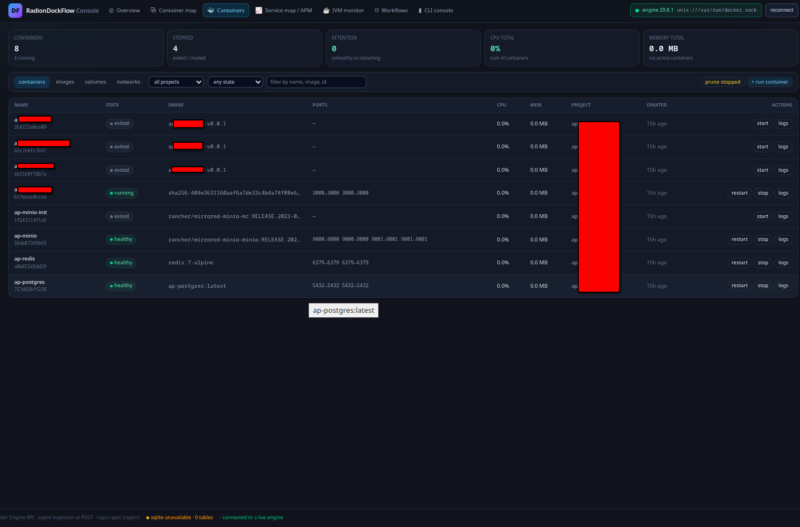
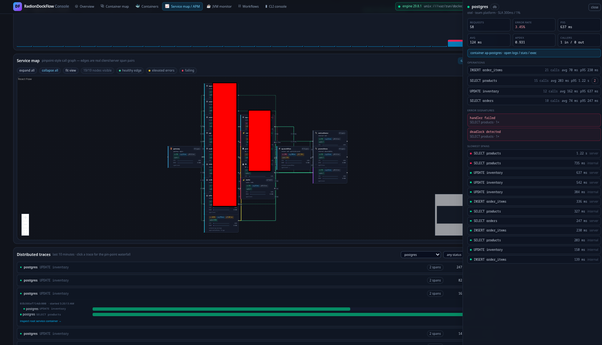
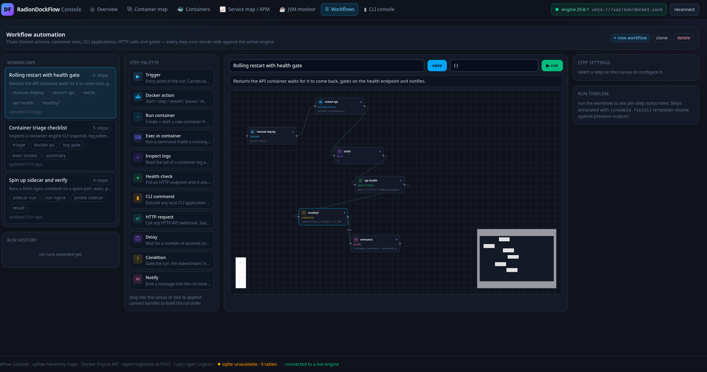
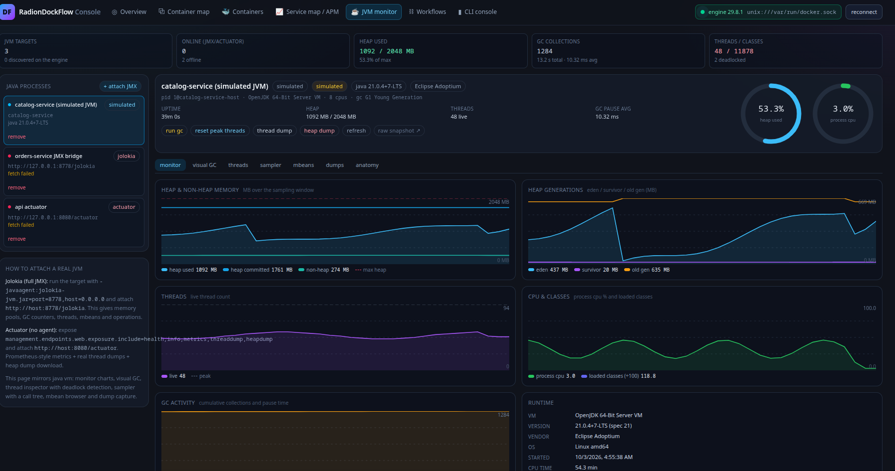

# RADION DOCKFLOW

### Check Out [AI Reproduction Prompt](./docs/reproduction-prompt.md)









# NODEJS + SQLLITE / POSTGRESQL

```
npm install  
npm audit fix --force  
npm install-scripts approve  --all  
npm run dev  
```

```
npm i drizzle-orm@rc @libsql/client dotenv  
npm i -D drizzle-kit@rc tsx  
npx drizzle-kit up  
npx drizzle-kit push --force  
```
## ATTRIBUTION:


## sqlite

Storage layer (src/db/)

src/db/schema.ts — ported every table to drizzle-orm/sqlite-core: uuid → TEXT PKs with randomUUID() defaults, jsonb → TEXT with { mode: "json" } (fully typed via $type<T>()), timestamptz → INTEGER with { mode: "timestamp" } (Dates in/out of JS), boolean → INTEGER { mode: "boolean" }, serial → INTEGER PRIMARY KEY AUTOINCREMENT. Unique indexes (hosts by address, services by key, agents by name+service, edges by source+target+protocol) are preserved.
src/db/bootstrap.ts — idempotent CREATE TABLE/INDEX IF NOT EXISTS DDL executed on boot, so a fresh sandbox needs zero migration steps. I diffed it against the DDL drizzle-kit push generates — identical shape.
src/db/index.ts — @libsql/client + drizzle-orm/libsql, idempotent bootstrap on startup, and an async databaseStats() helper. Configure a local file with SQLITE_PATH (default data/dockflow.db), or use TURSO_DATABASE_URL and TURSO_AUTH_TOKEN for a remote libsql/Turso database.
SQL dialect portability fixes

APM retention sweep no longer uses now() - interval '…'; it uses Drizzle's lt() with a JS date.
Edge rollup upsert switched greatest(...) → SQLite's scalar max(...) (still ON CONFLICT DO UPDATE with excluded.*).
Health route probes libsql asynchronously and reports the engine, table count and local file size when available.
Config

drizzle.config.json → dialect: "sqlite", schema src/db/schema.ts, file ./data/dockflow.db (I ran drizzle-kit push --force against it successfully).
next.config.ts → serverExternalPackages: ["better-sqlite3", "dockerode", …] so the native addon and dockerode's ssh2/cpu-features assets aren't bundled by Turbopack.
.gitignore ignores data/ and drizzle/.

## jvmPage

Added a JVM Monitor page (/jvm) with jvisualvm-level features, verified end-to-end on the live preview.

Attaching to real JVMs (two production paths, no RMI plumbing)
Jolokia JMX-over-HTTP — bulk-array protocol posting read/exec requests for Memory, MemoryPool,name=*, Threading, ClassLoading, OperatingSystem, Runtime, GarbageCollector,name=*, java.nio:type=BufferPool,name=*. Attach with -javaagent:jolokia-jvm.jar=port=8778 → http://host:8778/jolokia.
Spring Boot Actuator — metrics/jvm.memory.*|jvm.threads.*|jvm.classes.*|jvm.gc.pause|process.* plus /actuator/threaddump and streaming /actuator/heapdump.
Auto-discovery: Java-ish containers on the Docker engine (image/command/name hints) appear as JVM targets — vega-catalog and search-indexer were discovered automatically.
Offline targets keep and display the raw probe error (e.g. fetch failed / ECONNREFUSED), so you always know why a JVM isn't answering.
The tabs (mirroring jvisualvm)
Monitor — heap/non-heap, eden/survivor/old-gen, threads, cpu+classes, GC activity charts (hand-rolled SVG, no chart lib), max-heap band marker, plus a runtime panel (vm/version/vendor/os/uptime/jvm args/classpath/NIO buffers).
Visual GC — per-pool region bars (Eden, Survivor, Old, Metaspace, Compressed Class Space, CodeCache), GC event timeline with cause + pause + reclaimed MB, collector summary and GC overhead % of uptime.
Threads — state filter counts (RUNNABLE/WAITING/TIMED_WAITING/BLOCKED), name/frame search, per-thread stack pane, lock-holder columns and a deadlock banner. The detector builds a real wait-for graph from lockName/waitsOn/lockOwnerId and reports cycles: http-nio-8080-exec-7 → http-nio-8080-exec-11 with held/wanted monitors.
Sampler — server-side statistical CPU profiler that repeatedly pulls thread stacks (the same technique jvisualvm's sampler uses): start/stop/save within a configurable window, overlap-guarded ticks, self-time hot methods (correctly normalised so self% sums below 100), per-class allocation profile, and the call tree rendered as an expandable xyflow graph (26 nodes in the test run, root total 100%, hottest frame computeIfAbsent at 68.9%).
MBeans — domain → mbean → refreshable attribute table (both Jolokia list/read and a catalog with app MBeans like com.vega.catalog:type=Cache,name=productCache showing HitRatio/Size/Evictions), plus a curated safe operation list (run GC, reset peak threads, clear cache, reset rate limiter).
Dumps — thread dumps rendered in classic "thread-name" daemon prio=… Id=… STATE format with lock lines and the deadlock banner at the top; heap dumps via HotSpotDiagnostic.dumpHeap (Jolokia) / /actuator/heapdump streamed to disk (Actuator) / simulated hprof with a retained-size histogram; saved profiler snapshots. All persisted with size/path/summary + viewer and delete.
Anatomy — the JVM internals as an expandable xyflow hierarchy: JVM → memory (heap → each pool, non-heap → each pool), GC → collectors, threads → thread pools → individual threads, classes, CPU — with utilisation bars and aggregation chips.
Bugs I found and fixed while building it
Sampler stopped after one sample — the session overwrote its configured window with elapsed time; now durationMs (window) and elapsedMs are separate, with the first tick fired immediately.
self% exceeded 100% — percentages were based on tick count while each tick observes many thread stacks; now normalised by observed stacks (stackSamples).
Deadlock never detected — pool-generated threads collided with the planted pair's names, so the monitors had multiple owners; the planted pair now uses reserved names plus explicit lockOwnerId.
Charts/timeline always empty — the snapshot returned the history ring read before ticking; it now returns the live rings, and simulated JVMs get a back-filled history (31 points) and GC events (12) so the page is informative on first paint.
Nothing seeded on a fresh DB when only JVM routes were called — seeding is now also triggered from /api/jvm/targets and /api/health.
Schema grew to 11 SQLite tables (jvm_targets, jvm_dumps added, bootstrapped automatically). Typegen, tsc --noEmit, next build and build_and_start all pass; all 7 pages return 200 and the healthcheck reports sqlite up with 11 tables. I also extended docs/reproduction-prompt.md with a FEATURE 5 — JVM monitor section, the new API routes, acceptance test step 7, and a 11th scoring row so the prompt stays reproducible across models.

pm2 start npm --name "radion-dockflow" -- start -- -p 13000
pm2 delete 0